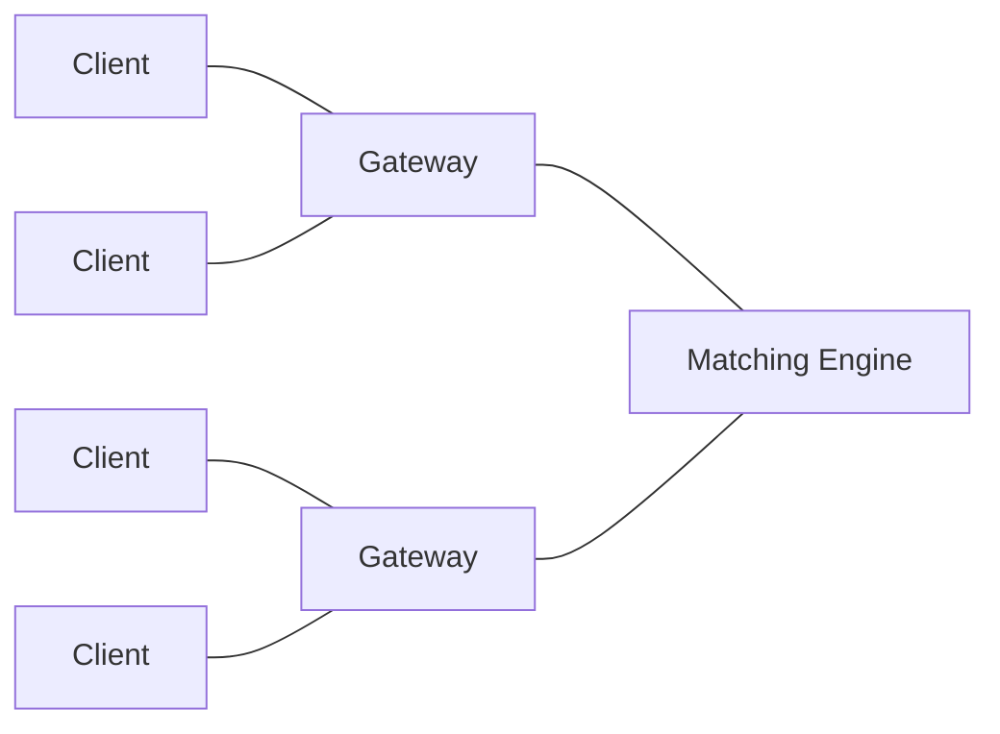

## Gateway

A matchingEngineServer to allow clients to interact with the matching engine without connecting to it directly.

```mermaid
flowchart LR
    M[Matching Engine]
    C1[Client] --- G1[Gateway]
    G1 --- M
    C2[Client] --- G1
    C3[Client] --- G2[Gateway]
    G2 --- M
    C4[Client] --- G2
```
