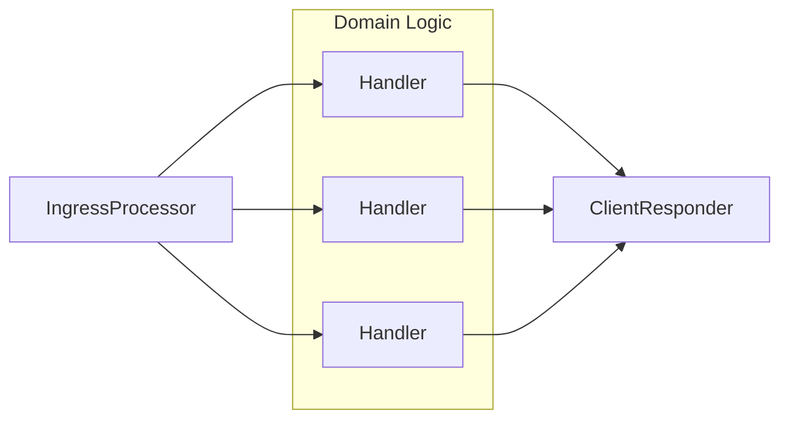

## Matching Engine

A central registry to allow users to find, join, and leave lobbies.

The schema for the message types that the matching engine sends and receives is available in `../lobby-message-codecs`.

